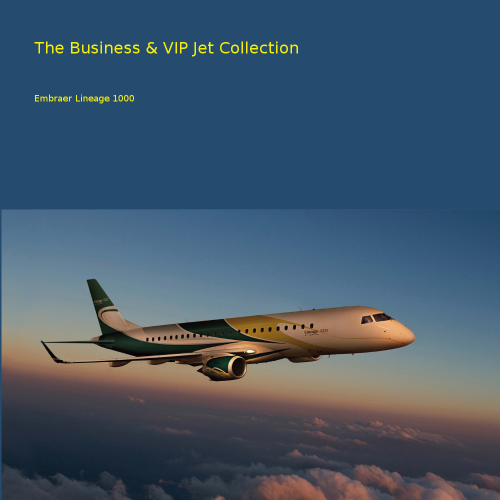

# Embraer Lineage 1000

### The Jabberwocky Hangar's

**Forum:** [www.thejabberwocky.net](http://www.thejabberwocky.net)

The Lineage 1000 is a deluxe version of the regional Jet ERJ190 produced by Embraer. It has a range of 4600 nm, transporting up to 19 first class passengers. 

It has a ceiling of 41000ft, and a maximum cruise speed of 0.82Ma.

Welcome to the luxury skies!

**Authors:** 

* &copy; 2011, Narendran Muraleedharan
* &copy; 2020, Peter Brendt,JWocky
* &copy; 2020, Israel Hernandez, IAHM-COL

**[License:](license.gpl-3.0.md)** GPL version 3 or later

This program is free software: you can redistribute it and/or modify it under the terms of the GNU General Public License as published by
    the Free Software Foundation, either version 3 of the License, or
    (at your option) any later version.

This program is distributed in the hope that it will be useful,
    but WITHOUT ANY WARRANTY; without even the implied warranty of
    MERCHANTABILITY or FITNESS FOR A PARTICULAR PURPOSE.  See the
    GNU General Public License for more details.

You should have received a copy of the GNU General Public License
    along with this program.  If not, see <https://www.gnu.org/licenses/>

